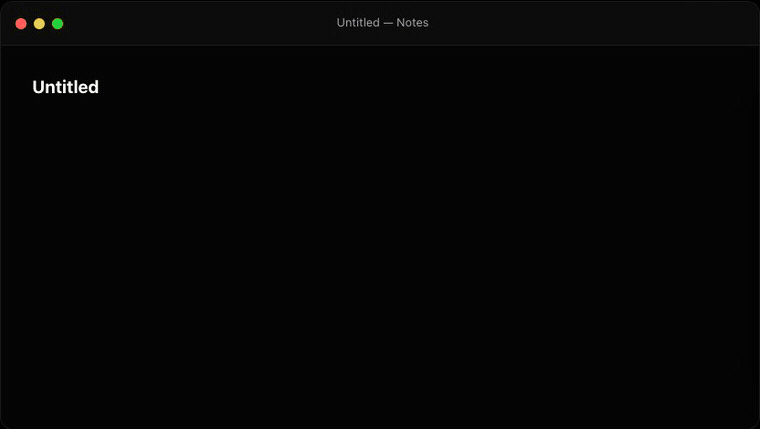

# PasteSheet

**PasteSheet: A smart clipboard manager designed to make pasting easier**  
Keep your clipboard history organized, editable, and instantly accessible — one
keystroke away, without ever leaving the keyboard.

🌐 **[Website](https://newfull5.github.io/PasteSheet/)** · 📦 **[Releases](https://github.com/newfull5/PasteSheet/releases)** · 🐛 **[Issues](https://github.com/newfull5/PasteSheet/issues)**

> ⚠️ **Beta Notice:** This project is currently in **Beta**. If you experience any issues or inconveniences, please report them in the [Issues](https://github.com/newfull5/PasteSheet/issues) section.

<p align="center"></p>

PasteSheet ships as **native apps** on both platforms — no Electron, no web view:

- **macOS** — Swift / SwiftUI
- **Windows** — WPF (.NET 8), distributed as a single self-contained `.exe` (no installer required)

## Installation

### macOS

**Method 1: Homebrew (Recommended)**

```bash
brew install --cask newfull5/tap/pastesheet
```

**Method 2: Direct Download**

1. Download the latest `.dmg` from the [**Releases**](https://github.com/newfull5/PasteSheet/releases/latest) page.
2. Open the `.dmg` and drag **PasteSheet** to your **Applications** folder.

> The build is a universal binary, so it runs natively on both Apple Silicon and Intel Macs.

### Windows

1. Download the latest `PasteSheet-*-win-x64.exe` from the [**Releases**](https://github.com/newfull5/PasteSheet/releases/latest) page.
2. Run it — it's a single self-contained executable, **no installer and no .NET runtime required**.

## Usage

| Action | macOS | Windows |
| :--- | :--- | :--- |
| **Toggle App** | `Cmd` + `Shift` + `V` | `Ctrl` + `Shift` + `V` |
| **Navigate** | `↑` `↓` `←` `→` Arrow Keys | `↑` `↓` `←` `→` Arrow Keys |
| **Paste / Select** | `Enter` | `Enter` |
| **Edit Item** | `Cmd` + `E` | `Ctrl` + `E` |
| **Close** | `Esc` | `Esc` |

**Pro Tip:** Move your mouse cursor to the **right edge** of the screen to quickly peek at your clipboard!

## 🛠 Troubleshooting

### ⚠️ macOS "Damaged" Error

Since this app is not signed with an Apple Developer certificate, macOS may show a "damaged" error or block the app from opening. To fix this, run the following command in your terminal:

```bash
xattr -cr /Applications/PasteSheet.app
```

Then, try opening the app again from your Applications folder.

## License

This project is licensed under the Apache License, Version 2.0.
